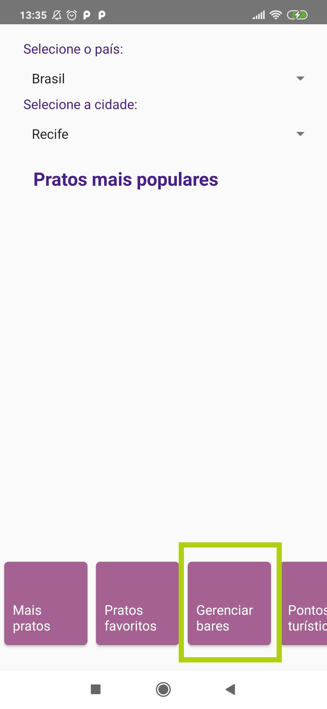
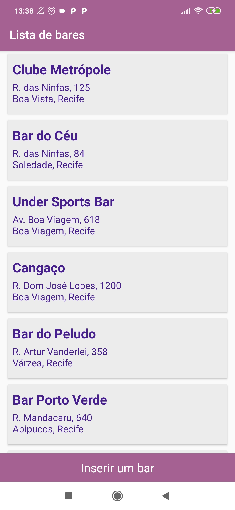
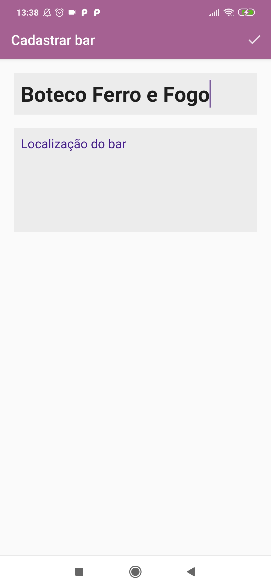

# final-mpoo
Repositório para a última entrega individual de MPOO.

A base para essa entrega foi o projeto do Wanderlust App.
Nela, é possível cadastrar placas locais de uma cidade, informando o nome e a localização do bar.
No menu, a opção 'Gerenciar placas' permite inserir novos placas e visualizar uma lista com todos já cadastrados.

